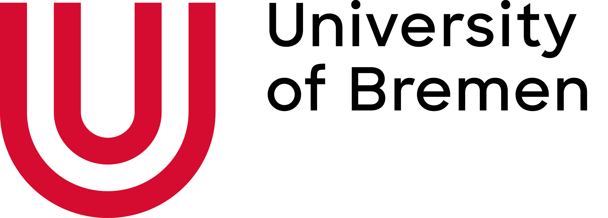
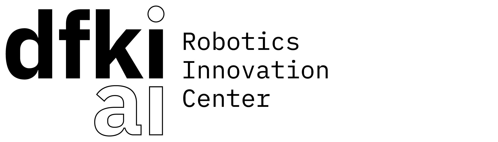

[](https://github.com/psf/black)
[](https://github.com/pre-commit/pre-commit)

# RL-BLOX

This project contains modular implementations of various model-free and model-based RL algorithms and consists of deep neural network-based as well as tabular representation of Q-Values, policies, etc. which can be used interchangeably. The goal of this project is for the authors to learn by reimplementing various RL algorithms and possible to eventually an algorithmic toolbox for research purposes.

## Design Principles

The implementation of this project follows the following principles:
1. Algorithms are functions!
2. Algorithms are implemented in single files.
3. Policies and values functions are data containers.

## Installation

```bash
git clone git@github.com:mlaux1/rl-blox.git
```

After cloning the repository, it is recommended to install the library in editable mode.

```bash
pip install -e .
```

## Contributing

If you wish to report bugs, please use the [issue tracker](https://github.com/mlaux1/rl-blox/issues). If you would like to contribute to DeformableGym, just open an issue or a
[pull request](https://github.com/mlaux1/rl-blox/pulls). The target branch for
merge requests is the development branch. The development branch will be merged to master for new releases. If you have
questions about the software, you should ask them in the discussion section.

The recommended workflow to add a new feature, add documentation, or fix a bug is the following:
- Push your changes to a branch (e.g. feature/x, doc/y, or fix/z) of your fork of the deformable_gym repository.
- Open a pull request to the latest development branch. There is usually an open merge request from the latest development branch to the main branch.
- When the latest development branch is merged to the main branch, a new release will be made.

Note that there is a checklist for new features.

It is forbidden to directly push to the main branch. Each new version has its own development branch from which a pull request will be opened to the main branch. Only the maintainers of the software are allowed to merge a development branch to the main branch.

## Releases

### Semantic Versioning

Semantic versioning must be used, that is, the major version number will be
incremented when the API changes in a backwards incompatible way, the minor
version will be incremented when new functionality is added in a backwards
compatible manner, and the patch version is incremented for bugfixes,
documentation, etc.


## Funding

This library is currently developed at the [Robotics Group](https://robotik.dfki-bremen.de/en/about-us/university-of-bremen-robotics-group.html) of the
[University of Bremen](http://www.uni-bremen.de/en.html) together with the
[Robotics Innovation Center](http://robotik.dfki-bremen.de/en/startpage.html) of the
[German Research Center for Artificial Intelligence (DFKI)](http://www.dfki.de) in Bremen.

<p float="left">
    
    
</p>
